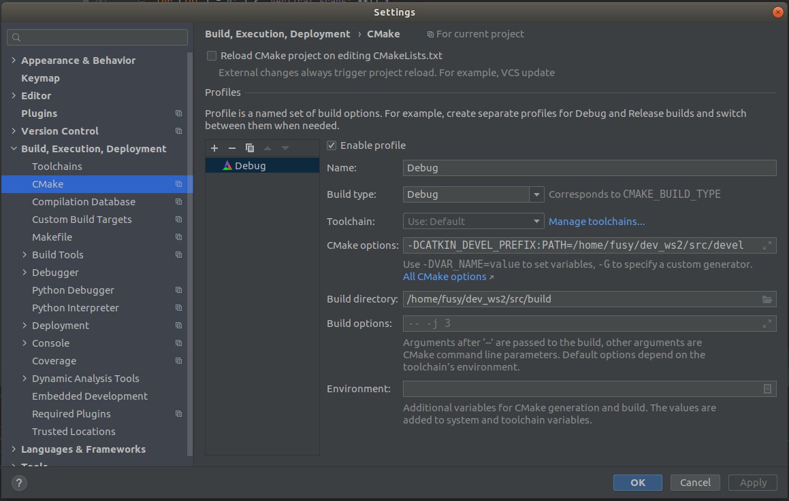

# ros_laboratory

### Requirements
 * Ubuntu 18.04
 * ROS melodic
 * ROS2 dashing

## Instructions to build everything

install catkin module (needed for build of ros melodic things)
```
  sudo apt-get install ros-melodic-catkin python-catkin-tools
```

install gtsam (follow https://github.com/eperdices/LeGO-LOAM-SR)
```
wget -O ~/Downloads/gtsam.zip https://github.com/borglab/gtsam/archive/4.0.0-alpha2.zip
cd ~/Downloads/ && unzip gtsam.zip -d ~/Downloads/
cd ~/Downloads/gtsam-4.0.0-alpha2/
mkdir build && cd build
cmake ..
sudo make install
```

### Terminal 1 (if you want to try lego_loam, for ros1 - optional)
```
cd dev_ws
source /opt/ros/melodic/setup.bash
catkin build
```
> I obtained some warnings that can be easily ignored

### Terminal 2
install colcon module
```
sudo sh -c 'echo "deb [arch=amd64,arm64] http://repo.ros2.org/ubuntu/main `lsb_release -cs` main" > /etc/apt/sources.list.d/ros2-latest.list'
curl -s https://raw.githubusercontent.com/ros/rosdistro/master/ros.asc | sudo apt-key add -
sudo apt update
sudo apt install python3-colcon-common-extensions
```
build lego_loam_sr
```
cd dev_ws2
source /opt/ros/dashing/setup.bash
catkin build
```
> I obtained some warnings that can be easily ignored

### Terminal 3
following https://industrial-training-master.readthedocs.io/en/melodic/_source/session7/ROS1-ROS2-bridge.html <br>
these are the fundamental instructions
```
cd ros1_bridge_ws/
source /opt/ros/melodic/setup.bash
source /opt/ros/dashing/setup.bash

source /dev_ws/devel/setup.bash
source /dev_ws2/install/setup.bash

colcon build --packages-select ros1_bridge --cmake-force-configure --cmake-args -DBUILD_TESTING=FALSE
```
> this build will take long (~ 13 minutes on my pc)


## Instructions to run everything

### Terminal 1
```
cd dev_ws/
source /opt/ros/melodic/setup.bash
roscore &
rosbag play *.bag --clock --topic /velodyne_points
```
> I used, for example, 2017-06-08-15-49-45_0.bag, downloaded from https://drive.google.com/drive/folders/1_t5fX5yIqY-y6sAifY8pVWX4O9LCK5R2?usp=sharing

### Terminal 2
```
cd dev_ws2/
source dev_ws2/src/install/setup.bash
ros2 launch lego_loam_sr run.launch.py
```
### Terminal 3

```
cd ros1_bridge_ws/
source bridgeinstall/local_setup.bash
ros2 run ros1_bridge dynamic_bridge --print-pairs
```

## Instructions to setup CLion (i.e., to work with LeGO-LOAM-SR and ROS2)
I followed this guide (https://www.jetbrains.com/help/clion/ros-setup-tutorial.html#set-build-paths).
Fundamental instructions:
1) source the workspace
```
source /opt/ros/dashing/setup.bash
```
2) source the particular directory
```
source dev_ws2/src/install/setup.bash
```
3) open clion
```
cd ~/clion-2020.3.3/bin/
./clion.sh
```
4) Click **File | Open** and select the src directory of the workspace *(dev_ws2/src)*
   then choose **Open as Project**.
5) In Build directory, set <WORKSPACE_DIRECTORY>/build.
6) In CMake options, add -DCATKIN_DEVEL_PREFIX:PATH=<WORKSPACE_DIRECTORY>/devel.


